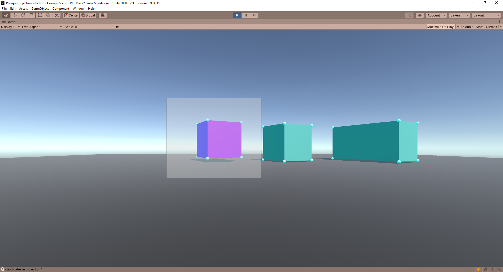

# 3d-projection-selector
A simple package to 3D rect select your units via a perspective projection.
** ( 3rd Perspective Projection // Simple Mode // Rotation Scaling Adaptive Bounds Mode ) **

#### Open the Scene file to get more explanations.

